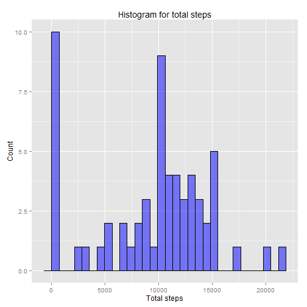
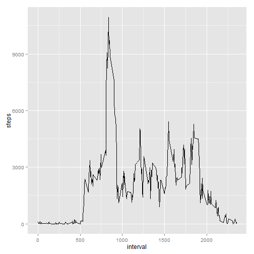
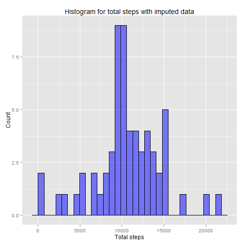
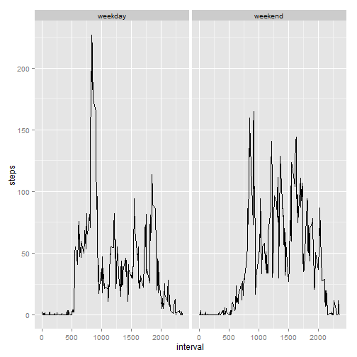

Assignment 1 - Reproducible Research
====================================

# Loading and preprocessing the data

Before doing any research, I'm going to read the csv file into R:

```r
data <- read.csv("activity.csv", sep = ",", header = TRUE)
```


<!-- 
##################################
########### Question 1 ###########
##################################
--> 

# What is mean total number of steps taken per day?

For this part of the assignment, I'm allowed to ignore the missing values in the dataset. The analysis is separated into three parts.


## Calculate the total number of steps taken per day
For this analysis, I'm going to use some libraries that need to be imported the _dplyr_ package. When reproducing the study, please make sure the libraries are installed on your system.

```r
library(dplyr)
library(chron)
```

Now, I can calculate the total number of steps per day by grouping the data and summarizing it:

```r
totalSteps <- data %>% group_by(date) %>% summarize(total_steps=sum(steps, na.rm = TRUE))
dim(totalSteps)
```

```
## [1] 61  2
```

```r
head(totalSteps)
```

```
## Source: local data frame [6 x 2]
## 
##         date total_steps
##       (fctr)       (int)
## 1 2012-10-01           0
## 2 2012-10-02         126
## 3 2012-10-03       11352
## 4 2012-10-04       12116
## 5 2012-10-05       13294
## 6 2012-10-06       15420
```

As you can see, the result table consists of 61 rows in total, that's why I've only printed the first 6 rows. Note, that there days where no steps have been recorded. For those the repective value is 0.


## Make a histogram of the total number of steps taken each day
I'm going to use ggplot2 for plotting the data.

```r
library(ggplot2)
```

The following code generates the needed histogram:

```r
g <- ggplot(data=totalSteps, aes(total_steps)) +
  geom_histogram(col="black", fill="blue", alpha=.5) +
  labs(title="Histogram for total steps") +
  labs(x="Total steps", y="Count")
g
```

 


## Calculate and report the mean and median of the total number of steps taken per day
The mean of the total steps per day is the following:

```r
mean(totalSteps$total_steps, na.rm = TRUE)
```

```
## [1] 9354.23
```

The median of the total steps per day is the following:

```r
median(totalSteps$total_steps, na.rm = TRUE)
```

```
## [1] 10395
```


<!-- 
##################################
########### Question 2 ###########
##################################
--> 

#What is the average daily activity pattern?
## Creating a time series plot of the 5-minute interval (x-axis) and the average number of steps taken, averaged across all days (y-axis)
For this plot, the first thing I need to do is to transform the data accordingly. This is done with the following commands:

```r
seriesData <- data %>% group_by(interval) %>% summarize(steps=sum(steps, na.rm = TRUE))
head(seriesData)
```

```
## Source: local data frame [6 x 2]
## 
##   interval steps
##      (int) (int)
## 1        0    91
## 2        5    18
## 3       10     7
## 4       15     8
## 5       20     4
## 6       25   111
```

The following code will construct and show the plot:

```r
g <- ggplot(seriesData, aes(x = interval, y = steps)) + geom_line()
g
```

 

##Which 5-minute interval, on average across all the days in the dataset, contains the maximum number of steps?
To answer this question, I need to adapt the previous transformation to calculate the average instead of the sum and summarize the data into a tidy table:

```r
numberOfDays <- nlevels(data$date)
averageSeriesData <- data %>% group_by(interval) %>% summarize(steps=sum(steps, na.rm = TRUE) / numberOfDays)
head(averageSeriesData)
```

```
## Source: local data frame [6 x 2]
## 
##   interval      steps
##      (int)      (dbl)
## 1        0 1.49180328
## 2        5 0.29508197
## 3       10 0.11475410
## 4       15 0.13114754
## 5       20 0.06557377
## 6       25 1.81967213
```
Note, that we cannot simply use the _mean_ function instead of _sum_ because _mean_ would divide by the number of days for which a value actually existed. Days, that have _NA_ steps would not be counted. To deal with this, I'm doing the normalization manually by dividing the sum by the actual number of days, which I got with the function _nlevels_.

I'm now going to find the interval with the highest number of average steps:

```r
averageSeriesData[averageSeriesData$steps == max(averageSeriesData$steps), ]
```

```
## Source: local data frame [1 x 2]
## 
##   interval    steps
##      (int)    (dbl)
## 1      835 179.1311
```

As expected from looking at the plot from before, the value had to be somewhere between 750 and 1000, since normalizing the data does not change much for this purpose. So the winning interval is number 835.


<!-- 
##################################
########### Question 3 ###########
##################################
--> 

# Imputing missing values
## Calculate and report the total number of missing values in the dataset
The only values we need to consider here are the steps. The following code finds the number of _NA_ values in this column:

```r
sum(is.na(data$steps))
```

```
## [1] 2304
```


## Devise a strategy for filling in all of the missing values in the dataset. The strategy does not need to be sophisticated.
Since I've already created subsets with the average steps for each interval, I'm going to use these values and replace all _NA_ values for each interval by the average value of this respective interval.


## Create a new dataset that is equal to the original dataset but with the missing data filled in
The following code accomplishes the devised strategy:

```r
cleanData <- data
cleanData[which(is.na(cleanData$steps)), 1] <- averageSeriesData$steps[match(cleanData[which(is.na(cleanData$steps)), 3], averageSeriesData$interval)]
head(cleanData)
```

```
##        steps       date interval
## 1 1.49180328 2012-10-01        0
## 2 0.29508197 2012-10-01        5
## 3 0.11475410 2012-10-01       10
## 4 0.13114754 2012-10-01       15
## 5 0.06557377 2012-10-01       20
## 6 1.81967213 2012-10-01       25
```

Since it's a little technical, I'm going to further explain the steps

* First, I create the new data set called _cleanData_
* In the second step, different things happen
    + On the left side of the assignment I select all the _steps_ cells of all lines where _steps_ is _NA_.
    + The right side of the assignement compares the interval values of a specific line and then takes the average value of steps from the _averageSeriesData_ dataset for the matching line. It looks a little trick, but only because I need to change several cells at once and don't want to use a for-loop. What basically happens is going to a line in _cleanData_, where _steps_ is _NA_, and then fetch the average step value from _averageSeriesData_ to insert it into the _cleanData_ data frame
* The fourth line code line shows the first 6 new lines of _cleanData_


## Make a histogram of the total number of steps taken each day and Calculate and report the mean and median total number of steps taken per day. Do these values differ from the estimates from the first part of the assignment? What is the impact of imputing missing data on the estimates of the total daily number of steps?
For this purpose, I transform the data again:

```r
totalSteps <- cleanData %>% group_by(date) %>% summarize(total_steps=sum(steps))
```

After that I use the same code to generate the historam as in the first task:

```r
g <- ggplot(data=totalSteps, aes(total_steps)) +
  geom_histogram(col="black", fill="blue", alpha=.5) +
  labs(title="Histogram for total steps with imputed data") +
  labs(x="Total steps", y="Count")
g
```

 

The mean and the median are calculated analogously:

```r
mean(totalSteps$total_steps)
```

```
## [1] 10581.01
```

```r
median(totalSteps$total_steps)
```

```
## [1] 10395
```

After all, the data does not change that much according to mean and median. The zero values are reduced because there are less _NA_s treated as zero, and some minor changes are happening in the average area. Still, I don't think that's a valid approach in statistics :-D


# Are there differences in activity patterns between weekdays and weekends?
## Create a new factor variable in the dataset with two levels – “weekday” and “weekend” indicating whether a given date is a weekday or weekend day.
In order to do so, I defined a custom function that outputs a corresponding string value for a given date:

```r
myfun <- function(x) {
  if(is.weekend(as.Date(x))){
      "weekend"
  } else {
      "weekday"
  }
}
```

Now I can use this funtion to create a new column with the _mutate_ function. I've also converted the new column to a factor type.

```r
cleanData <- cleanData %>% rowwise %>% mutate('type_of_day' = myfun(date))
cleanData$'type_of_day' <- as.factor(cleanData$'type_of_day')
str(cleanData$type_of_day)
```

```
##  Factor w/ 2 levels "weekday","weekend": 1 1 1 1 1 1 1 1 1 1 ...
```

```r
head(cleanData)
```

```
## Source: local data frame [6 x 4]
## 
##        steps       date interval type_of_day
##        (dbl)     (fctr)    (int)      (fctr)
## 1 1.49180328 2012-10-01        0     weekday
## 2 0.29508197 2012-10-01        5     weekday
## 3 0.11475410 2012-10-01       10     weekday
## 4 0.13114754 2012-10-01       15     weekday
## 5 0.06557377 2012-10-01       20     weekday
## 6 1.81967213 2012-10-01       25     weekday
```


## Make a panel plot containing a time series plot (i.e. type = "l") of the 5-minute interval (x-axis) and the average number of steps taken, averaged across all weekday days or weekend days (y-axis).
With the work done so far this can be done easily now by grouping the clean data set by both variables _type_of_day_ and _interval_ and then calculating the mean if the steps. The multipanel plot is then created with the help of _facet_wrap_.

```r
numberOfDays <- sum(cleanData$type_of_day == "weekday")
averageSeriesData <- cleanData %>% group_by(type_of_day, interval) %>% summarize(steps=mean(steps))

g <- ggplot(averageSeriesData, aes(x = interval, y = steps)) + geom_line() + facet_wrap(~type_of_day)
g
```

 

